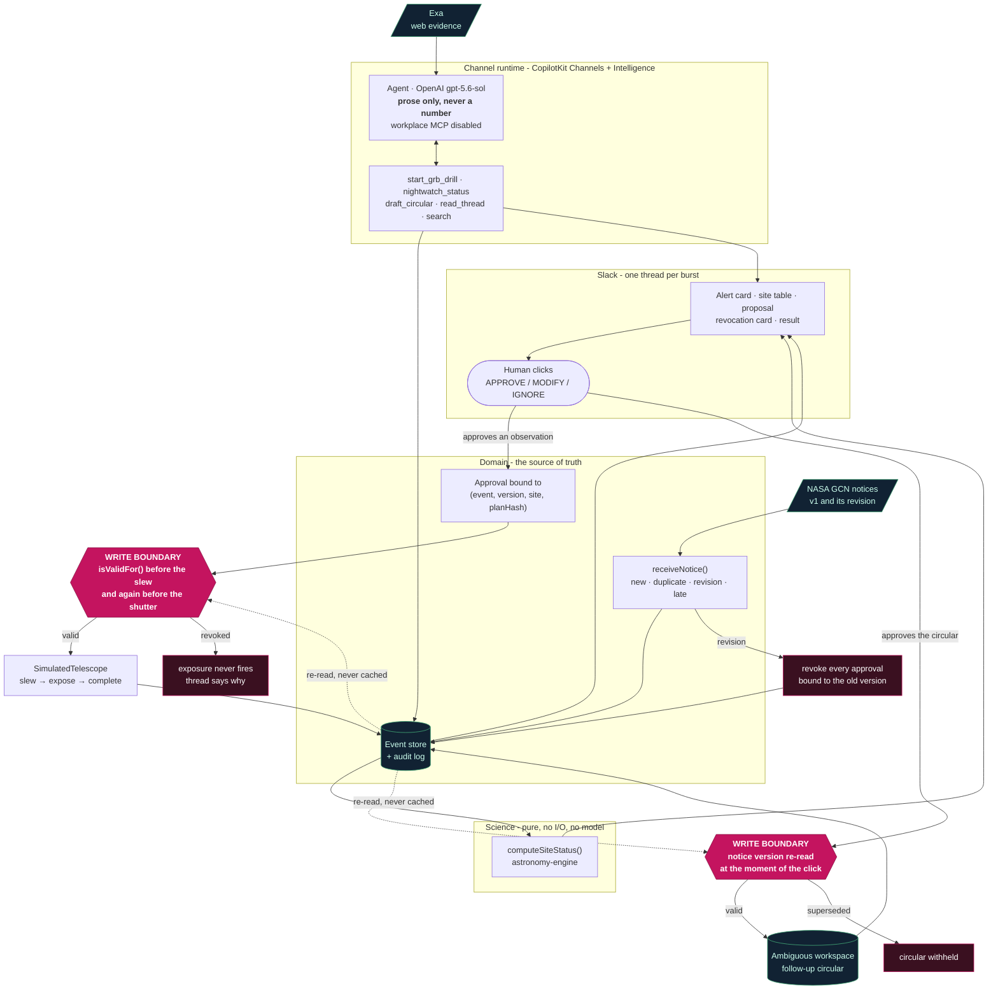

<div align="center">

# NightWatch

**An agent that revokes its own approval.**

A transient-astronomy follow-up coordinator that lives in a Slack thread — and when a revised
alert invalidates the plan a human already approved, it voids that consent in front of you and
proposes a repoint.

</div>

---

## The thesis

Most "human-in-the-loop" agents treat approval as a checkpoint: the human clicks, the agent
proceeds. That is fine while the world holds still. It does not hold still.

A gamma-ray burst alert arrives with a localisation good to a few degrees. Minutes later a revised
notice moves the position — sometimes across the sky. Any approval given against the first notice is
now consent for an observation of empty sky, and the telescope does not know that.

**NightWatch binds consent to exactly one `(event, notice version, site, plan hash)` and re-checks
it immediately before every telescope call — including after the slew has already started.** When a
revision lands, standing approvals are revoked at the moment the notice is taken in, the thread
says so, and the exposure never fires.

The interesting property is not that it asks permission. It is that **permission expires**, and the
system is the thing that notices.

## Demo video

**▶ [Watch the two-minute demo](https://youtu.be/YdIQkHb4CXU)**

[](https://youtu.be/YdIQkHb4CXU)

The video shows one complete run: a notice lands, three sites are compared, a human approves, the
revision arrives mid-slew, the approval visibly voids with the coverage lost, and the repoint is
approved and completes.

## What you are looking at

| | |
|---|---|
| **Surface** | Slack, one thread per burst, via CopilotKit Channels |
| **Deployed URL** | Not deployed. The Channel listener is a long-running websocket worker, not a request handler; run it locally with `npm run dev:slack`, or with the included `Dockerfile` |
| **Repository** | https://github.com/MehulMittal27/nightwatch |
| **Telescope** | **SIMULATED.** Every card says so. No real observatory is contacted. |

## Consent tiers

Every action is classified before it is written. **If a tier cannot be decided, it is tier 3.**

| Tier | Applies to | Behaviour |
|---|---|---|
| 1 · Silent | Recalculation, state refresh, re-evaluation | Acts, posts a compact status |
| 2 · Announce + veto | Re-evaluating scheduling, extending an exposure, standing a site down | Announces; silence proceeds; Stop cancels |
| 3 · **Block** | **Any telescope action** | Explicit human approval. **Never proceeds on a timeout.** |

There is no auto-approval, no confidence threshold, and no timeout-to-proceed anywhere in the
system.

## The trust split

| Decided by code | Decided by a language model | Decided by a human |
|---|---|---|
| Every coordinate, altitude, Moon separation, observing window, exposure time and SNR | The prose in the thread | Whether the telescope moves |
| Which site is recommended | Which tool to call | Whether a revised plan is worth approving |
| Whether consent is still valid | — | Whether the circular is written to the workspace |
| The full text of the circular, composed from the audit log | — | — |

**No number in this system is produced by a language model.** The cards are rendered in code
directly from the event store; the agent is told, in its own context, that it must say `unknown`
rather than estimate. A number in a model response is a bug, not a degradation.

## Architecture

Two gates, drawn in red. Everything a human decides passes through one of them.



**Read it this way:** the model sits in the top box and holds no numbers and no workspace tools.
Every figure comes from the science layer or the store. Every external action — moving the telescope,
writing the circular — leaves through a red gate, and each gate re-reads consent from the store at
the instant of the call rather than trusting the click that authorised it.

**Where the code lives**

| | |
|---|---|
| `src/nightwatch/domain/` | models, state machine, event store, audit log |
| `src/nightwatch/science/` | `astronomy-engine` visibility. Pure: no I/O, no model calls |
| `src/nightwatch/adapters/` | telescope interface, deterministic simulator, the first gate |
| `src/nightwatch/replay/` | real NASA GCN payloads and their loader |
| `apps/channel/src/nightwatch.tsx` | the Slack surface and every card |
| `apps/channel/src/ambiguous.ts` | the workspace MCP client, behind the second gate |

## The write-boundary question, and how we answer it

The starter kit's sponsor guide is explicit:

> *"Approval prompts and cards guide behavior but do not enforce a gate around every MCP tool. For
> your own app, enforce required authorization at the write boundary."*
>
> — [`using-sponsor-tools.md`](using-sponsor-tools.md)

**That gate is this project.** `executeApprovedPlan` in
[`adapters/telescope.ts`](src/nightwatch/adapters/telescope.ts) is the only path to the hardware,
and the adapter behind it is deliberately dumb: it slews and exposes, and it has no opinion about
whether it is allowed to. The authorisation decision lives at the boundary, is re-read from the
store rather than cached, and runs twice — once before the mount moves and again before the shutter
opens, because a revision can land during the slew.

A blocked call is not an exception path bolted on afterwards. It returns as a tool result, the
model re-plans, and the thread explains what happened.

**The same gate guards the workspace.** Ambiguous exposes create, edit, share and
permanent-delete tools. Handing those to the model would be an ungated external write — the exact
failure this project argues against — so **workplace MCP is disabled for the model entirely**
(`apps/channel/src/agent.ts`). The workspace is reachable only through `draft_circular`, which
composes the follow-up circular from the event store, posts it for approval, and writes nothing
until a human clicks. The notice version is re-read at the moment of that click, so a revision
landing while the draft sits on screen **withholds** the circular rather than publishing a result
about a superseded localisation.

One more thing that boundary now enforces: an MCP tool failure arrives as a *successful* JSON-RPC
response carrying `isError`. Ignore it and the thread reports a write that never happened. It is
checked, and a write that returns no document id is refused rather than confirmed.

## Failure design

| Failure | Behaviour |
|---|---|
| Revision lands mid-slew | Exposure blocked, approval voided, coverage loss shown, repoint proposed |
| Duplicate notice | Existing thread updated. No second request, no second observation |
| Late lower-version notice | Recorded; the current version stays current; consent survives |
| Retry of an executed plan | Returns the first observation. The telescope is never commanded twice |
| Click on a card a revision already overtook | Refused outright — the human is re-asked against the new proposal |
| Telescope rejects the slew | Recorded as a failure with its reason, not swallowed |
| No site can observe the burst | Says so. Proposes nothing |
| Missing or stale input | Renders as `unknown` and **blocks** automatic recommendation |

## Idempotency

Every external action is keyed on:

```
(eventId, noticeVersion, telescope, planHash)
```

A retry with the same key returns the original observation and commands nothing. `planHash` covers
only the fields that determine what the telescope is told to do — so rewording a proposal's stated
assumptions does not void consent, while changing the pointing, exposure, filter or count does.

## Known limitations

Stated plainly because the project's argument is about honesty.

- **Windows are altitude-only.** The science computes whether a target clears a site's altitude
  limit. It does not model the Sun, so a reported window can fall during the site's daytime.
  Nothing in the code or the cards calls it a night-time window.
- **`RECOMMENDED` does not gate on the Moon.** Separation is computed and displayed, but no
  threshold is defined, so it informs rather than decides.
- **Notice coordinates are J2000, fed to a routine that wants equator-of-date.** Measured at under
  0.33°, which is 3× to 100× inside the notices' own error radii, and it changes no recommendation
  in any tested case.
- **The drill is started by asking.** Channels has no proactive-posting API — a thread only exists
  once something inbound creates it. Everything after that first message happens with nobody typing.
- **Auth0 was cut** when the Slack provisioning overran. See `SUBMISSION.md`.
- **The event store is in-process.** Restarting the runtime resets the demo.

## Related work

Approval gating in agent frameworks (LangGraph interrupts, CopilotKit's own approval cards)
generally models consent as a **checkpoint in the run**. NightWatch models it as a **claim about
state that can be falsified later** — closer to optimistic concurrency control than to a
confirmation dialog. `planHash` is the version token; `isValidFor` is the compare-and-swap.

The operational problem is real: GCN notice revisions are routine, and follow-up telescopes do
waste time on superseded localisations.

## Run it

Node.js 22+ required.

```bash
git clone https://github.com/MehulMittal27/nightwatch.git
cd nightwatch
npm ci
cp .env.example .env
```

Fill in `.env`:

| Variable | Where from |
|---|---|
| `MODEL_PROVIDER=openai`, `MODEL=gpt-5.6-sol`, `OPENAI_API_KEY` | OpenAI |
| `INTELLIGENCE_API_KEY` | CopilotKit Intelligence, project-scoped (`cpk-…`) |
| `CHANNEL_CODE` | The Channel **Code** in Intelligence — not the channel ID |
| `INTELLIGENCE_CHANNEL_<CODE>_SLACK_BOT_TOKEN` / `..._SIGNING_SECRET` | Your Slack app, **after** reinstalling it |
| `EXA_API_KEY` | Exa (optional; the template auto-registers it) |

Create the Slack app from the CLI-emitted manifest rather than by hand — it carries the 17 scopes,
10 bot events, and the separate interactivity endpoint that a hand-made app will be missing:

```bash
npx copilotkit@latest login
npx copilotkit@latest project select --project <your-project>
npx copilotkit@latest channels add <channel-code> --adapter slack --json
```

Then:

```bash
npm run verify      # typecheck + tests, no credentials needed
npm run dev:slack   # wait for: Channel "<code>" online
```

In Slack: `/invite @yourbot`, then in a thread — `@yourbot start the drill`.

**Run exactly one runtime.** Two processes declaring the same channel race per delivery and the
loser silently gets nothing.

## Tests

```bash
npm run verify
```

The suite is the argument, not decoration. `a version bump invalidates a standing approval` and
`a revision landing DURING the slew stops the exposure` are the two that matter; if either goes
red, nothing else about this project is true.

The astronomy was independently verified: altitude and Moon separation were reimplemented from
scratch in Python (Meeus, no `astronomy-engine`) and agree to **0.002°** and **0.004°** across
twelve site/target combinations. That review found and fixed a real defect — every observing window
ended one grid step late, at an instant the target was already below the site's limit.

## Built with

**CopilotKit Channels** (the Slack surface, cards, and both approval round-trips) · **OpenAI
`gpt-5.6-sol`** (prose only, never a number) · **Exa** (evidence lookup) · **Ambiguous**
(the follow-up circular, written to the workspace only behind the gate) · **astronomy-engine**
(all visibility computation) · **NASA GCN** (real notice payloads)

Starter kit: [CopilotKit/agents-everywhere-starter-kit](https://github.com/CopilotKit/agents-everywhere-starter-kit).
See [`SUBMISSION.md`](SUBMISSION.md) for exactly what was inherited and what was built during the event.
